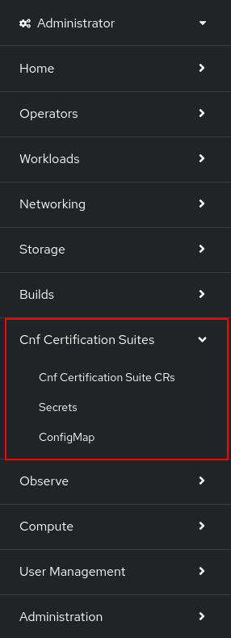
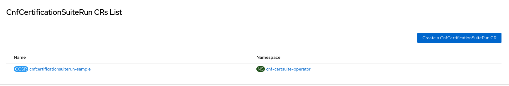
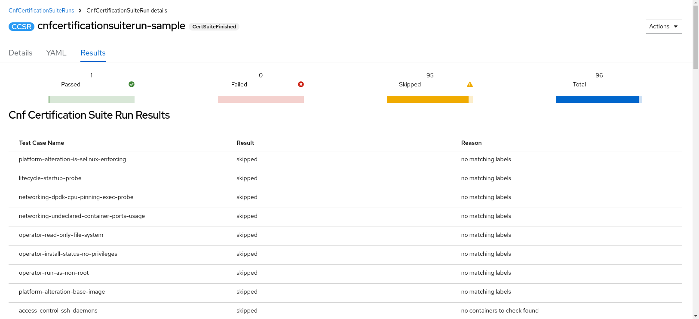

# CNF Certification Suite Operator's Console Plugin

## Description

The `CNF certsuite plugin` is an
[openshift dynamic console plugin](https://github.com/openshift/console/tree/master/frontend/packages/console-dynamic-plugin-sdk)
extending the [OpenShift UI](https://github.com/openshift/console)
for the CNF Certification Suite Operator.

This console plugin allows the possibility to run the
[CNF certification suites](https://github.com/test-network-function/cnf-certification-test)
and review their results using the openshift console.

## Getting started

In order to extend the openshift console with the `CNF certsuite plugin`,
you'll need to install the
[CNF certification suite operator](https://github.com/test-network-function/cnf-certsuite-operator)
on your cluster.

## Enable plugin

After installing the `CNF certification operator`, you might need to enable the plugin.

### Option 1: Operator was installed using OLM subscription

In this case the plugin should be automatically enabled.
If not, You can enable the plugin by navigating from `Operators` →
`Installed Operators` → `cnf-certsuite-operator`.
There, check the `Console plugin` checkbox as `Enabled` and refresh the page.

### Option 2: Operator was manually deployed

In this case the plugin is not automatically enabled.
You can enable the plugin by navigating from
`Administration` → `Cluster Settings` → `Configuration` →
`Console operator.openshift.io` → `Console plugins`,
and manually enabling the `cnf-certsuite-plugin`.

## Using the plugin

Once the operator is installed and the plugin is enabled,
you should see a new tab added to the navigation bar:

<!-- markdownlint-disable-next-line no-inline-html -->

<!-- markdownlint-enable-next-line no-inline-html -->

You can add the required resources detailed
[here](https://github.com/test-network-function/cnf-certsuite-operator?tab=readme-ov-file#how-to-customize-the-cnf-certification-suite-run),
by navigating to the corresponding tabs and using the `create` option.

The CNF certification test results will appear under the
`CNF certification Suite CR's` corresponding to the created
cnf certification run CR name.

See example:

Under the `Results` tab you can find the CNF certification suites results.

See example:

